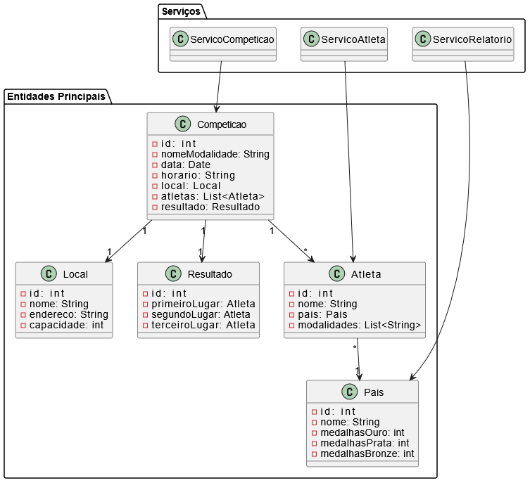
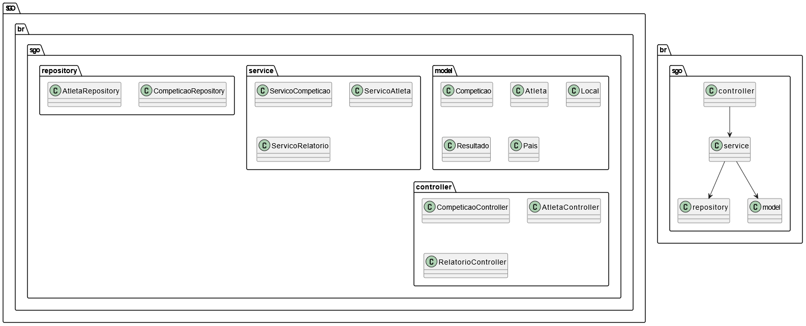
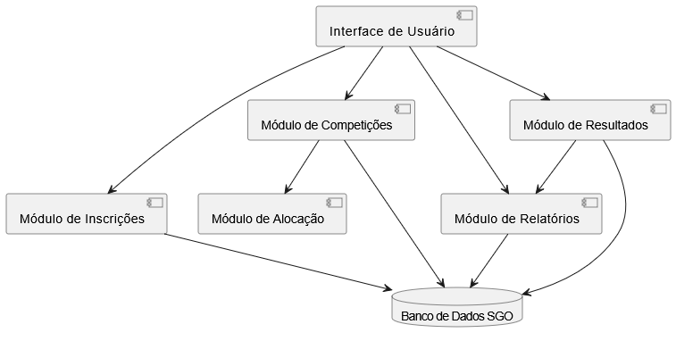

# Sistema de Gestão das Olimpíadas (SGO)

## Descrição Geral

Com a chegada das Olimpíadas, um novo sistema de gestão é necessário para coordenar os diferentes aspectos do evento.  
O **SGO – Sistema de Gestão das Olimpíadas** tem como objetivo permitir o **gerenciamento de competições, inscrições de atletas, alocação de locais e controle de resultados**, além da geração de relatórios de medalhas por país.

### Funcionalidades Principais
- Cadastro e gerenciamento de **competições**;
- **Inscrição de atletas** em modalidades específicas;
- **Alocação de locais** para evitar conflitos de horário;
- Registro e controle de **resultados e medalhas**;
- Emissão de **relatórios de desempenho por país**.

---

## Histórias de Usuário

### **US01 – Cadastrar Competição**
**Como** administrador,  
**quero** cadastrar novas competições, informando modalidade, data, horário e local,  
**para** organizar o cronograma oficial das provas olímpicas.

**Critérios de Aceitação**
- Deve ser possível inserir os dados da competição (modalidade, data, horário, local).  
- O sistema deve validar se o local está disponível no horário informado.  
- A competição é salva com a lista de atletas inicialmente vazia.  
- O administrador pode visualizar e editar competições cadastradas.

---

### **US02 – Inscrever Atleta**
**Como** atleta,  
**quero** me inscrever em uma competição específica,  
**para** participar oficialmente da disputa.

**Critérios de Aceitação**
- Cada atleta deve estar associado a um país.  
- O sistema deve impedir conflitos de horário em inscrições.  
- O atleta pode participar de várias competições.  
- A lista de atletas é atualizada automaticamente na competição.

---

### **US03 – Alocar Local**
**Como** administrador,  
**quero** alocar locais físicos para cada competição,  
**para** garantir que não ocorram conflitos de horário e estrutura.

**Critérios de Aceitação**
- Um local só pode sediar uma competição por vez.  
- O sistema deve alertar em caso de conflito de data/hora.  
- A alocação deve ser registrada na competição.  
- Deve ser possível reatribuir o local se necessário.

---

### **US04 – Registrar Resultados**
**Como** organizador,  
**quero** registrar os resultados das competições (1º, 2º e 3º lugar),  
**para** atualizar automaticamente o quadro de medalhas dos países.

**Critérios de Aceitação**
- Deve ser possível selecionar os três primeiros colocados entre os atletas inscritos.  
- O resultado fica associado à competição.  
- O sistema atualiza o total de medalhas de ouro, prata e bronze de cada país.  
- Resultados podem ser consultados e alterados antes do fechamento oficial.

---

### **US05 – Gerar Relatório de Medalhas**
**Como** administrador,  
**quero** gerar relatórios de medalhas por país,  
**para** acompanhar o desempenho geral das delegações.

**Critérios de Aceitação**
- O relatório exibe o total de medalhas de ouro, prata e bronze por país.  
- Deve permitir ordenar ou filtrar países por desempenho.  
- O relatório é atualizado automaticamente conforme novos resultados são registrados.  
- Deve haver opção de exportação ou impressão.

---

### **US06 – Consultar Competições e Inscrições**
**Como** atleta,  
**quero** visualizar as competições disponíveis e minhas inscrições,  
**para** acompanhar minha agenda olímpica.

**Critérios de Aceitação**
- O sistema lista todas as competições disponíveis com detalhes.  
- O atleta pode consultar suas próprias inscrições.  
- As informações devem incluir modalidade, data, horário e local.

---

## Diagramas UML

Os diagramas abaixo representam as modelagens exigidas pelo projeto conforme as regras de negócio.

---

### Diagrama de Caso de Uso

---

### Diagrama de Classes

---

### Diagrama de Pacotes

---

### Diagrama de Componentes

---

### 🖥️ Diagrama de Implantação

