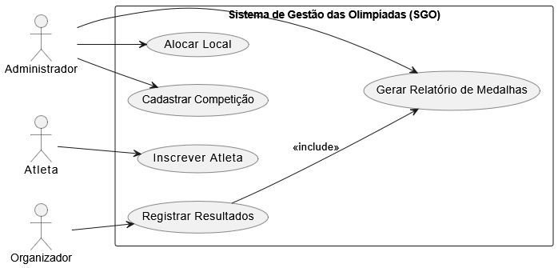
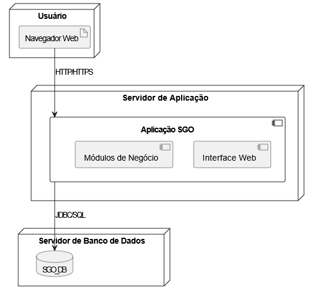

# Sistema de Gestão das Olimpíadas (SGO)

### Funcionalidades Principais
- Cadastro e gerenciamento de **competições**;
- **Inscrição de atletas** em modalidades específicas;
- **Alocação de locais** para evitar conflitos de horário;
- Registro e controle de **resultados e medalhas**;
- Emissão de **relatórios de desempenho por país**.

---

## Histórias de Usuário

### **US01 – Cadastrar Competição**
**Como** administrador,  
**quero** cadastrar novas competições, informando modalidade, data, horário e local,  
**para** organizar o cronograma oficial das provas olímpicas.

---

### **US02 – Inscrever Atleta**
**Como** atleta,  
**quero** me inscrever em uma competição específica,  
**para** participar oficialmente da disputa.

---

### **US03 – Alocar Local**
**Como** administrador,  
**quero** alocar locais físicos para cada competição,  
**para** garantir que não ocorram conflitos de horário e estrutura.

---

### **US04 – Registrar Resultados**
**Como** organizador,  
**quero** registrar os resultados das competições (1º, 2º e 3º lugar),  
**para** atualizar automaticamente o quadro de medalhas dos países.

---

### **US05 – Gerar Relatório de Medalhas**
**Como** administrador,  
**quero** gerar relatórios de medalhas por país,  
**para** acompanhar o desempenho geral das delegações.

---

## Diagramas UML

---

### Diagrama de Caso de Uso

---

### Diagrama de Classes

---

### Diagrama de Pacotes

---

### Diagrama de Componentes

---

### 🖥️ Diagrama de Implantação

